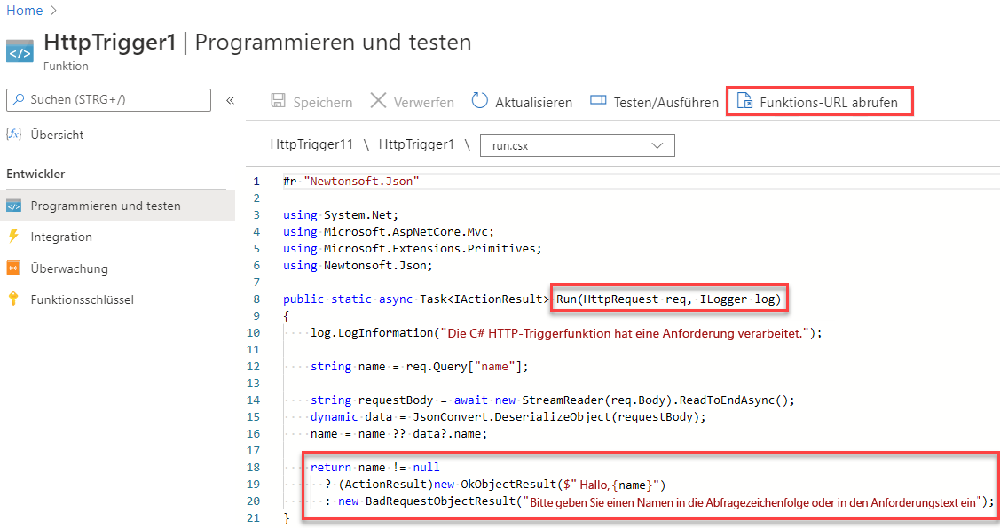
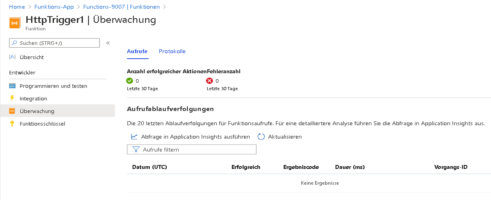

---
wts:
    title: '08 - Implementieren von Azure Functions (5 Min.)'
    module: 'Modul 03: Kernlösungen und Verwaltungstools beschreiben'
---
# 08 – Implementieren von Azure Functions (5 Min.)

In dieser exemplarischen Vorgehensweise erstellen wir eine Funktions-App, um eine Hallo-Meldung anzuzeigen, wenn eine HTTP-Anforderung vorliegt. 

# Aufgabe 1: Eine Funktions-App erstellen 

In dieser Aufgabe erstellen wir eine Funktions-App.

1. Melden Sie sich beim [Azure-Portal](https://portal.azure.com) an.

2. Suchen Sie in der Leiste **Suchen** oben im Portal nach **Funktions-App**, wählen Sie den Eintrag aus, und klicken Sie dann auf dem Blatt **Funktions-App** auf **+ Hinzufügen**, **+ Erstellen**, **+ Neu**.

3. Geben Sie auf dem Blatt **Funktions-App** auf der Registerkarte **Basic** die folgenden Einstellungen an (ersetzen Sie **xxxx** im Funktionsnamen durch Buchstaben und Ziffern, sodass der Name global eindeutig ist, und belassen Sie für alle anderen Einstellungen die Standardwerte): 

    | Einstellungen | Wert |
    | -- | --|
    | Abonnement | **Standardwert beibehalten** |
    | Ressourcengruppe | **Erstellen einer neuen Ressourcengruppe** |
    | Name der Funktions-App | **Funktion-xxxx** |
    | Veröffentlichen | **Code** |
    | Runtime-Stapel | **NET** |
    | Version | **3,1** |
    | Region | **USA, Osten** |

    **Hinweis** - Denken Sie daran, **xxxx** zu ändern, sodass sich ein eindeutiger **Funktions-App-Name** ergibt

4. Klicken Sie auf **Überprüfen + erstellen**. Klicken Sie nach erfolgreicher Validierung auf **Erstellen**, um mit der Bereitstellung Ihrer neuen Azure Funktions-App zu beginnen.

5. Warten Sie auf die Benachrichtigung, dass die Ressource erstellt wurde.

6. Warten Sie, bis die Bereitstellung abgeschlossen wurde, und klicken Sie auf dem Blatt „Bereitstellung“ auf „Zur Ressource wechseln“. Alternativ können Sie zurück zum Blatt **Funktions-App** navigieren, auf **Aktualisieren** klicken und überprüfen, ob die neu erstellte Funktions-App mit dem Status **Wird ausgeführt** angezeigt wird. 

    

# Aufgabe 2: Erstellen und Testen einer durch HTTP ausgelöste Funktion

In dieser Aufgabe verwenden wir die Webhook + API-Funktion, um eine Nachricht anzuzeigen, wenn eine HTTP-Anforderung vorliegt. 

1. Klicken Sie auf dem Blatt **Funktions-App** auf die neu erstellte Funktions-App. 

2. Klicken Sie auf dem Blatt „Funktions-App“ im Abschnitt **Funktionen** auf **Funktionen** und dann auf **+ Hinzufügen**, **+ Erstellen**, **+ Neu**.

    

3. Ein Popupfenster **Funktion hinzufügen** wird auf der rechten Seite geöffnet. Klicken Sie im Abschnitt **Vorlage auswählen** auf **HTTP-Trigger**. Klicken Sie auf **Hinzufügen** 

    

4. Klicken Sie auf dem Blatt **HttpTrigger1** im Abschnitt **Entwickler** auf **Code + Test**. 

5. Überprüfen Sie den automatisch generierten Code auf dem Blatt **Code und Test**, und beachten Sie, dass der Code eine HTTP-Anforderung ausführt und Informationen protokolliert. Beachten Sie außerdem, dass die Funktion eine Hallo-Meldung mit einem Namen zurückgibt. 

    

6. Klicken Sie auf **Funktions-URL abrufen** im oberen Abschnitt des Funktions-Editors. 

7. Stellen Sie sicher, dass der Wert in der Dropdownliste **Schlüssel** auf **Standard** gesetzt ist, und klicken Sie auf **Kopieren**, um die Funktions-URL zu kopieren. 

    

8. Öffnen Sie eine neue Browser-Registerkarte und fügen Sie die kopierte Funktions-URL in die Adressleiste Ihres Webbrowsers ein. Wenn die Seite angefordert wird, wird die Funktion ausgeführt. Beachten Sie die ausgegebene Nachricht, dass die Funktion einen Namen im Anforderungstext benötigt.

    

9. Fügen Sie **&name=*yourname*** an das Ende der URL an.

    **HINWEIS**: Falls Sie „Cindy“ heißen, lautet die endgültige URL wie folgt: `https://azfuncxxx.azurewebsites.net/api/HttpTrigger1?code=X9xx9999xXXXXX9x9xxxXX==&name=cindy`

    

10. Wenn Sie die Eingabetaste drücken, wird Ihre Funktion ausgeführt, und alle Aufrufe werden nachverfolgt. Um die Ablaufverfolgungen anzuzeigen, kehren Sie im Portal zum Blatt **HttpTrigger1 \** zurück. **| Code + Test** zurück, und klicken Sie auf **Monitor**. Sie können Application Insights **konfigurieren**, indem Sie den Zeitstempel auswählen und auf **Abfrage in Application Insights ausführen** klicken.

     

Herzlichen Glückwunsch! Sie haben eine Funktions-App erstellt, um eine Hallo-Meldung anzuzeigen, wenn eine HTTP-Anforderung vorliegt. 

**HINWEIS**: Um zusätzliche Kosten zu vermeiden, können Sie diese Ressourcengruppe bei Bedarf entfernen. Suchen Sie nach Ressourcengruppen, klicken Sie auf Ihre Ressourcengruppe und dann auf **Ressourcengruppe löschen**. Überprüfen Sie den Namen der Ressourcengruppe, und klicken Sie dann auf **Löschen**. Überwachen Sie die **Benachrichtigungen**, um zu sehen, wie der Löschvorgang abläuft.
