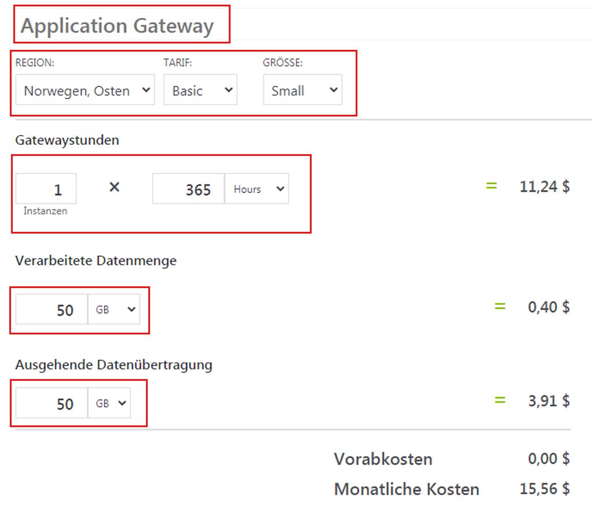
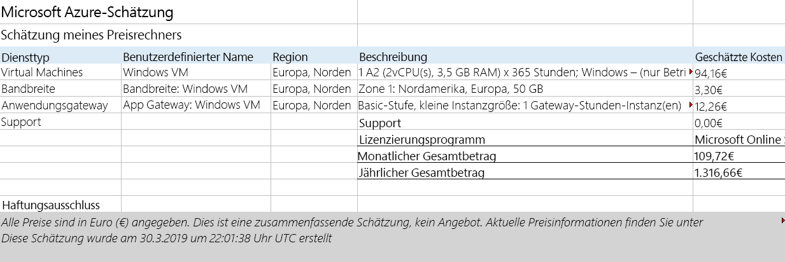

---
wts:
    title: '19 – Verwenden des Azure-Preisrechners (10 Min.)'
    module: 'Modul 06: Beschreiben von Azure Cost Management und der Vereinbarungen zum Servicelevel'
---
# 19 – Verwenden des Preisrechners (10 Min.)

In dieser exemplarischen Vorgehensweise verwenden wir den Azure-Preisrechner, um einen Kostenvoranschlag für einen virtuellen Azure-Computer und zugehörige Netzwerkressourcen zu erstellen.

# Aufgabe 1: Konfigurieren des Preisrechners

In dieser Aufgabe schätzen wir die Kosten einer Infrastruktur-Stichprobe mithilfe des Azure-Preisrechners ab. 

**HINWEIS**: Um eine Azure-Preisrechnerschätzung zu erstellen, enthält diese exemplarische Vorgehensweise Beispielkonfigurationen für den virtuellen Computer und die zugehörigen Ressourcen. Verwenden Sie diese Beispielkonfigurationen, oder stellen Sie stattdessen dem Azure-Preisrechner Details zu Ihren *tatsächlichen* Ressourcenanforderungen zur Verfügung.

1. Navigieren Sie in einem Browser zur Webseite mit dem [Azure-Preisrechner](https://azure.microsoft.com/de-de/pricing/calculator/).

2. Klicken Sie auf der Registerkarte **Produkte** auf **Virtual Machines**, um Details zu Ihrer Konfiguration des virtuellen Computers hinzuzufügen. Scrollen Sie nach unten, um die Details des virtuellen Computers anzuzeigen. 

3. Ersetzen Sie den Text **Ihre Schätzung** und **Virtuelle Computer** durch aussagekräftigere Namen für Ihre Azure-Preisrechnerschätzung und Ihre VM-Konfiguration. In dieser exemplarischen Vorgehensweise wird **Meine Preisrechnerschätzung** für die Schätzung und **Virtueller Windows-Computer** für die Konfiguration des virtuellen Computers verwendet.

   

4. Ändern Sie die Standardkonfiguration des virtuellen Computers.

    | Einstellungen | Wert |
    | -- | -- |
    | Region | **Europa, Norden** |
    | Betriebssystem | **Windows** |
    | Typ | **(Nur Betriebssystem)** |
    | Ebene | **Standard** |  
    | Instanz | **A2: 2 Kernspeicher, 3,5 GB RAM, 135 GB temporärer Speicher** |

   

    **HINWEIS**: Die Spezifikationen und Preise der Instanzen des virtuellen Computers können von denen in diesem Beispiel abweichen. Folgen Sie dieser exemplarischen Vorgehensweise, indem Sie eine Instanz auswählen, die dem Beispiel so genau wie möglich entspricht. Wählen Sie im Menü **Mehr Info** auf der rechten Seite die Option **Produktdetails** aus, um Details zu den verschiedenen Produktoptionen des virtuellen Computers anzuzeigen.

5. Legen Sie **Abrechnungsoption** auf **Vorausbezahlung** fest.

   

6. In Azure wird ein Monat als 730 Stunden definiert. Wenn Ihr virtueller Computer jeden Monat zu 100 Prozent verfügbar sein muss, setzen Sie den Wert für Stunden pro Monat auf `730`. In dieser exemplarischen Vorgehensweise muss ein virtueller Computer jeden Monat zu 50 Prozent verfügbar sein.

    Belassen Sie die Anzahl der virtuellen Computer auf `1`, und ändern Sie den Wert für Stunden pro Monat zu `365`.

   

7. Ändern Sie im Bereich **Verwaltete BS-Datenträger** die standardmäßige VM-Speicherkonfiguration.

    | Ebene | Diskgröße | Zahl der Disks | Momentaufnahme | Speichertransaktionen |
    | ---- | --------- | --------------- | -------- | -------------------- |
    | HDD Standard | S30: 1.024 GiB | 1 | Aus | 10.000 |

   

8. Informationen zum Hinzufügen von Netzwerkbandbreite zu Ihrer Schätzung finden Sie oben auf der Azure-Preisrechner-Webseite. Klicken Sie auf **Netzwerk** im Produktmenü links und dann auf die Kachel **Bandbreite**. Klicken Sie im Meldungsdialogfeld **Bandbreite hinzugefügt** auf **Anzeigen**.

   

9. Fügen Sie einen Namen für die Bandbreitenkonfiguration Ihres virtuellen Computers hinzu. In diesem exemplarischen Beispiel lautet der Name **Bandbreite: Windows-VM**. Ändern Sie die standardmäßige Bandbreitenkonfiguration, indem Sie die folgenden Details hinzufügen.

    | Region | Betrag für ausgehende Datenübertragung in Zone 1 |
    | ------ | -------------------------------------- |
    | Europa, Norden | 50 GB |

   

10. Kehren Sie zum Hinzufügen eines Application Gateway zum Anfang der Azure-Preisrechner-Webseite zurück. Klicken Sie im Produktmenü **Netzwerk** auf die Kachel **Application Gateway**. Klicken Sie im Meldungsdialogfeld **Application Gateway** auf **Anzeigen**.

    

11. Fügen Sie einen Namen für Ihre Application Gateway-Konfiguration hinzu. In dieser exemplarischen Vorgehensweise ist der Name **App Gateway: Windows-VM**. Ändern Sie die Standardkonfiguration des Application Gateway, indem Sie die folgenden Details hinzufügen.

    | Einstellungen | Wert |
    | -- | -- |
    | Region | **Europa, Norden** |
    | Ebene | **Basic** |
    | Größe | **Small** |
    | Instanzen | **1** |  
    | Stunden | **365** |
    | Verarbeitete Daten | **50 GB** |
    | Zone 1: Nordamerika, Europa | **50 GB**|

    

# Aufgabe 2: Überprüfen der Preisschätzung

In dieser Aufgabe werden die Ergebnisse des Azure-Preisrechners überprüft. 

1. Scrollen Sie zum Ende der Azure-Preisrechner-Webseite, um die Gesamtsumme der **Geschätzten monatlichen Kosten** anzuzeigen.

    **HINWEIS**: Informieren Sie sich über die verschiedenen Optionen, die im Azure-Preisrechner verfügbar sind. In dieser exemplarischen Vorgehensweise müssen Sie beispielsweise die Währung auf Euro aktualisieren.

2. Ändern Sie die Währung in Euro und wählen Sie dann **Export**, um eine Kopie des Kostenvoranschlags für die Offline-Anzeige im Microsoft Excel-Format (`.xlsx`) herunterzuladen.

    

    

Herzlichen Glückwunsch! Sie haben einen Kostenvoranschlag aus dem Azure-Preisrechner heruntergeladen.
